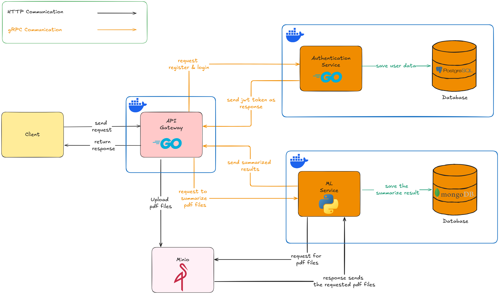

<h1 align="center">

RecruitEase - Backend

</h1>
<p align="center">
  
</p>

Welcome to the backend repository for **RecruitEase**! This is the "brain" behind an AI-powered application designed to make recruitment super efficient.

---

### 🌟 Overview

**RecruitEase is an AI-based platform designed to automate CV summarization, enabling HR teams to review and evaluate hundreds of applications quickly and efficiently.**

As the Backend Developer and System Designer for this project, I was fully responsible for building the "engine" that runs behind the scenes, ensuring all the cool features function smoothly. This includes everything from the APIs, authentication, to integrating with machine learning services and file storage.

---

### 💡 How This Backend Works

The project is built using **microservices architecture**. Interestingly, the decision to go with this architecture wasn't driven solely by traditional technical reasons. Since the project involved development in 2 distinct programming languages and repositories, I saw it as a perfect opportunity to get hands-on with microservices rather than a monolithic approach. This allowed me to deeply understand the benefits of independent services. Strange reason, isn't it? hahahaha

Here's a rough overview (check out the architecture diagram below for a better visual):

* **Client (User):** This is a frontend application developed using react js. They will send requests to our backend.

* **API Gateway (Go):** Think of this as our main "receptionist." All requests from the client land here first. It's responsible for routing requests to the correct service. Built with Go for lightning-fast performance!

* **Authentication Service (Go):** This part handles user registration and login, as well as JWT-based authentication. User data is securely stored in a reliable **PostgreSQL** database.

* **ML Service (Python):** This is our star player! When a CV is uploaded, the request to summarize it is sent here. Since this part deals with AI and data processing, we used Python, which excels in this area. The summary results are then stored in a flexible **MongoDB** database.

* **MinIO (File Storage):** This is our secure spot for storing all the uploaded PDF CV files. It's similar to Google Drive/S3, but can be self-hosted.

* **Inter-Service Communication:** Our services talk to each other using a combination of **HTTP** and **gRPC**. The HTTP protocol is used for communication between the client and the gateway and the gateway and Minio. Meanwhile, internal services use gRPC.

**System Architecture Diagram:**


---

### 🛠️ Tech Stack

To develop the backend, here we use several technologies:

| Category          | Technology            | Purpose/Role                                                                                                                              |
| :---------------- | :-------------------- | :----------------------------------------------------------------------------------------------------------------------------------------- |
| **Languages** | Go                    | For API Gateway & Authentication Service. Used with `net/http`.                               |
| **Databases** | PostgreSQL            | Reliable relational database for user authentication data.                                                                               |
|                   | MongoDB               | Flexible NoSQL database for storing dynamic ML summary results.                                                                          |
| **File Storage** | MinIO                 | Self-hostable object storage solution for PDF CV files.                                                                                  |
| **Communication** | HTTP                  | Web standard protocol (client-gateway, gateway-MinIO communication).                                                                     |
|                   | gRPC                  | Super-fast protocol for internal inter-service communication.                                                                           |
| **Go Tools** | buf CLI               | For managing Protobuf definitions.                                                                     |
|                   | zerolog               | For structured and efficient logging in Go services.                                                                                     |
| **CI/CD** | GitHub Actions        | For continuous integration of Gateway & Authentication services.                                                            |
|                   | go-sec                | Static analysis security testing (SAST) tool used within GitHub Actions to ensure code security.                                         |
| **Testing** | testify               | Go testing framework, used for writing comprehensive unit tests (assertions, mocks, etc.).                                                 |
|                   | gomock                | Mocking framework for Go, used to generate test doubles for unit testing.                                                                |
|                   | Testcontainers        | For setting up disposable database environments for integration testing (specifically for the Authentication service).                 |                                            |
| **Containerization**| Docker & Docker Compose | For containerizing and orchestrating all services, making deployment easier.                                                              |

---

### 🧱 Project Structure
This is the directory structure of this project

<pre>
.
├── Makefile
├── authentication_service
│   ├── Dockerfile
│   ├── cmd
│   │   └── main.go
│   ├── db
│   │   ├── conn.go
│   │   └── migrations
│   │       ├── 000001_create_users_table.down.sql
│   │       └── 000001_create_users_table.up.sql
│   ├── go.mod
│   ├── go.sum
│   ├── internal
│   │   ├── handler
│   │   │   └── auth_handler.go
│   │   ├── model
│   │   │   └── user_model.go
│   │   ├── repository
│   │   │   └── auth_repository.go
│   │   ├── usecase
│   │   │   └── auth_usecase.go
│   │   └── utils
│   │       ├── error
│   │       │   └── custom_error.go
│   │       ├── log
│   │       │   └── log.go
│   │       └── regex
│   │           └── regex.go
│   └── test
│       ├── handler
│       │   ├── auth_handler_test.go
│       │   ├── usecase_mock_test.go
│       │   └── validator_mock_test.go
│       ├── integration
│       │   └── integration_test.go
│       ├── repository
│       │   └── auth_repository_test.go
│       └── usecase
│           ├── auth_usecase_test.go
│           ├── jwt_mock_test.go
│           └── repo_mock_test.go
├── buf.gen.yaml
├── buf.lock
├── buf.yaml
├── docker-compose.yaml
├── gateway
│   ├── Dockerfile
│   ├── cmd
│   │   └── main.go
│   ├── go.mod
│   ├── go.sum
│   ├── internal
│   │   ├── config
│   │   │   └── config.go
│   │   ├── handler
│   │   │   ├── auth_handler.go
│   │   │   └── batch_pdf_processing_handler.go
│   │   ├── middleware
│   │   │   └── middleware.go
│   │   ├── model
│   │   │   ├── authentication_model.go
│   │   │   └── batch_processor_model.go
│   │   ├── usecase
│   │   │   ├── auth_usecase.go
│   │   │   └── batch_pdf_processing_usecase.go
│   │   └── utils
│   │       ├── context
│   │       │   └── context.go
│   │       ├── error
│   │       │   └── custom_error.go
│   │       ├── minio
│   │       │   └── minio.go
│   │       ├── response
│   │       │   └── response.go
│   │       └── utils.go
│   └── test
│       ├── handler
│       └── usecase
│           ├── auth_usecase_test.go
│           ├── batch_pdf_processing_usecase_test.go
│           ├── cv_processor_mock_test.go
│           ├── grpc_auth_client_mock_test.go
│           └── minio_mock_test.go
├── go.work
├── go.work.sum
├── pkg
│   ├── go.mod
│   ├── go.sum
│   ├── jwt
│   │   └── jwt.go
│   └── proto
│       └── v1
│           ├── auth.pb.go
│           ├── auth.proto
│           ├── auth_grpc.pb.go
│           ├── cv_processor.pb.go
│           ├── cv_processor.proto
│           └── cv_processor_grpc.pb.go
├── readme.MD
└── resource
    ├── Group 3.png
    └── RecruitEase-System-Architecture.png
</pre>


### 🏃‍♂️ Getting Started

This project requires a few services to run, so **Docker** and **Docker Compose** will make things much easier for you.

1.  **Prerequisites:**
    * `Go` (1.24.2)
    * `Docker` & `Docker Compose` (make sure they are installed on your system)
    * `Git`
    * `Buf-CLI` (You can install it by following the method from the official documentation -> https://buf.build/docs/cli/installation/)

2.  **Clone the Repository:**
    ```bash
    git clone https://github.com/RecruitEase-Capstone/recruitEase-BE.git && cd recruitEase-BE
    ```

3.  **Configure Environment Variables:**
    Create a `.env` file in the project's root directory. Example:
    ```dotenv
    # .env
    DB_USERNAME=root
    DB_PASSWORD=imagesmith22
    DB_PORT=5430
    DB_CONTAINER_PORT=5432
    DB_HOST=localhost
    DB_NAME=capstone-db

    JWT_SECRET_KEY=7af79e29d7a2d2d2215da854e1a81257a1b844a018eff71a0486f8f4395ebf7e
    JWT_EXPIRED=60m

    AUTH_SERVICE_HOST=localhost
    AUTH_SERVICE_PORT=9002

    ML_SERVICE_HOST=localhost
    ML_SERVICE_PORT=50052

    GATEWAY_SERVICE_PORT=8024

    UID=1000
    GID=1000

    MINIO_API_HOST=localhost
    MINIO_API_PORT=9000
    MINIO_WEBUI_PORT=9001
    MINIO_ROOT_USER=MIAUWWW
    MINIO_ROOT_PASSWORD=RAHASIA123
    MINIO_BUCKET_NAME=pdf-batch
    ```

4.  **Build and Run All Services with Docker Compose:**
    ```bash
    make compose-up
    ```
    This command will build all Docker images and spin up PostgreSQL, MongoDB, MinIO, API Gateway, and Authentication Service. Give it a moment until all containers are *running*.

5.  **Access the API:**
    * The API Gateway runs on `http://localhost:8024`.
    * You can use Postman to test the endpoints.

---

### 🔌 Key API Endpoints

Here are some of the main endpoints you can test. For complete details, check the **[Postman](https://documenter.getpostman.com/view/30865611/2sB2qXm3ub)**.

* **Authentication (Auth Service via API Gateway):**
    * `POST /auth/register`: To register a new user.
    * `POST /auth/login`: To log in and get a JWT token.
* **Upload & Summarize CV (ML Service via API Gateway):**
    * `POST /cv/upload`: Upload a PDF CV file.
    * `GET /cv/history`: Get all the summarized CV by user ID.

---

### 📚 Learnings & Challenges (My Journey)

This project is quite challenging but a lot of fun! Maybe we should start with the fun part first. The fun part is that I can learn many things from this project, starting from how the **microservice architecture** works, how **gRPC** works and why it is used in **internal communication** in a microservice architecture.  In addition, I learned how to do **integration testing** to test all components in the authentication service using **testcontainer** (this tool is really cool) whether they communicate well or not.

But of course, not everything is fun.

At first, I was honestly confused. Designing a system from scratch with microservices is a lot of work. I kept asking myself: “What should be its own service? Should this logic stay in the gateway or be moved into a specific service? How should the repository be structured if we use a monorepo pattern?” That phase was full of trial and error, tons of Googling, and a little help from AI hints.

One of the biggest headaches I faced was with gRPC and protobuf — specifically, the process of generating protobuf files using protoc. The command-line arguments felt overly complex and not intuitive at all. I kept running into errors every time I tried to generate the stubs. That was, until I discovered Buf CLI, which made everything so much more manageable and less frustrating.

Another pain point was integrating gRPC communication between the API Gateway (written in Go) and the ML Service (written in Python), which live in completely separate repositories. Figuring out how to structure the shared protobuf definitions, where to store them, and how to sync changes across services took quite a bit of time and experimentation. Dealing with different ecosystems — Go modules on one side and Python packaging on the other — only added to the complexity.

Overall, this project significantly deepened my understanding of *system design*, *distributed systems*, and *backend development*!

---